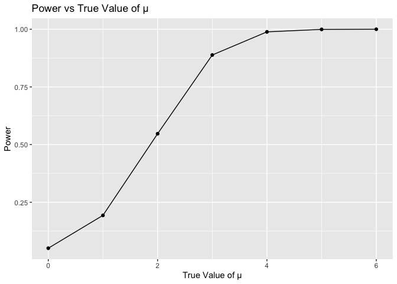
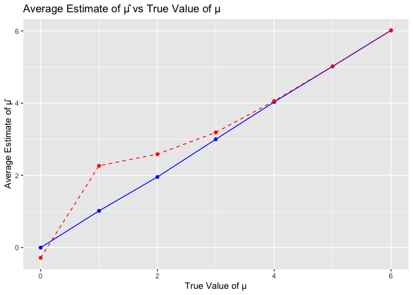

Homework5
================
Qianying Wu
2023-11-12

## Problem 1

## Problem 2

``` r
# List all CSV files in the directory
file_paths <- list.files(path = "data", pattern = "\\.csv$", full.names = TRUE)

library(tidyverse)

process_file <- function(file_path) {
  # Read the file
  data <- read.csv(file_path)

  subject_id <- strsplit(basename(file_path), "[_.]")[[1]][2]

  if (grepl("con", file_path)) {
    arm <- "Control"
    }
  else{
    arm <- "Experimental"
    }

  data <- mutate(data, `Subject ID` = subject_id, Arm = arm)
  return(data)
}


combined_data <- purrr::map_df(file_paths, process_file)

combined_data
```

    ##    week_1 week_2 week_3 week_4 week_5 week_6 week_7 week_8 Subject ID
    ## 1    0.20  -1.31   0.66   1.96   0.23   1.09   0.05   1.94         01
    ## 2    1.13  -0.88   1.07   0.17  -0.83  -0.31   1.58   0.44         02
    ## 3    1.77   3.11   2.22   3.26   3.31   0.89   1.88   1.01         03
    ## 4    1.04   3.66   1.22   2.33   1.47   2.70   1.87   1.66         04
    ## 5    0.47  -0.58  -0.09  -1.37  -0.32  -2.17   0.45   0.48         05
    ## 6    2.37   2.50   1.59  -0.16   2.08   3.07   0.78   2.35         06
    ## 7    0.03   1.21   1.13   0.64   0.49  -0.12  -0.07   0.46         07
    ## 8   -0.08   1.42   0.09   0.36   1.18  -1.16   0.33  -0.44         08
    ## 9    0.08   1.24   1.44   0.41   0.95   2.75   0.30   0.03         09
    ## 10   2.14   1.15   2.52   3.44   4.26   0.97   2.73  -0.53         10
    ## 11   3.05   3.67   4.84   5.80   6.33   5.46   6.38   5.91         01
    ## 12  -0.84   2.63   1.64   2.58   1.24   2.32   3.11   3.78         02
    ## 13   2.15   2.08   1.82   2.84   3.36   3.61   3.37   3.74         03
    ## 14  -0.62   2.54   3.78   2.73   4.49   5.82   6.00   6.49         04
    ## 15   0.70   3.33   5.34   5.57   6.90   6.66   6.24   6.95         05
    ## 16   3.73   4.08   5.40   6.41   4.87   6.09   7.66   5.83         06
    ## 17   1.18   2.35   1.23   1.17   2.02   1.61   3.13   4.88         07
    ## 18   1.37   1.43   1.84   3.60   3.80   4.72   4.68   5.70         08
    ## 19  -0.40   1.08   2.66   2.70   2.80   2.64   3.51   3.27         09
    ## 20   1.09   2.80   2.80   4.30   2.25   6.57   6.09   4.64         10
    ##             Arm
    ## 1       Control
    ## 2       Control
    ## 3       Control
    ## 4       Control
    ## 5       Control
    ## 6       Control
    ## 7       Control
    ## 8       Control
    ## 9       Control
    ## 10      Control
    ## 11 Experimental
    ## 12 Experimental
    ## 13 Experimental
    ## 14 Experimental
    ## 15 Experimental
    ## 16 Experimental
    ## 17 Experimental
    ## 18 Experimental
    ## 19 Experimental
    ## 20 Experimental

``` r
combined_data <- combined_data |> pivot_longer(
    cols = starts_with("week_"), 
    names_to = "Week",           
    values_to = "Observation"   
  ) |>
  mutate(
    Week = parse_number(Week),
    Arm = factor(Arm, levels = c("Control", "Experimental"))
  )

head(combined_data)
```

    ## # A tibble: 6 × 4
    ##   `Subject ID` Arm      Week Observation
    ##   <chr>        <fct>   <dbl>       <dbl>
    ## 1 01           Control     1        0.2 
    ## 2 01           Control     2       -1.31
    ## 3 01           Control     3        0.66
    ## 4 01           Control     4        1.96
    ## 5 01           Control     5        0.23
    ## 6 01           Control     6        1.09

``` r
## Draw the spaghetti plot
ggplot(combined_data, aes(x = Week, y = Observation, group = `Subject ID`, color = Arm)) +
  geom_line() +
  geom_point() +
  facet_wrap(~ Arm, nrow = 1) + 
  labs(title = "Spaghetti Plot of Subject Observations in different Weeks",
       x = "Week",
       y = "Observation",
       color = "Group") +
  scale_color_manual(values = c("Control" = "blue", "Experimental" = "red"))
```

<!-- -->

## Problem 3

First set the following design elements:

Fix n=30 Fix σ=5 Set μ=0. Generate 5000 datasets from the model

x∼Normal\[μ,σ\]

For each dataset, save μ̂ and the p-value arising from a test of H:μ=0
using α=0.05. Hint: to obtain the estimate and p-value, use broom::tidy
to clean the output of t.test.

``` r
n <- 30
sigma <- 5
mu <- c(0, 1, 2, 3, 4, 5, 6)
iteration <- 5000
alpha <- 0.05


stat_test <- function(n, sigma, mu, iteration, alpha){
  pval_list <- c()
  mu_hat_list <- c()
  rej_est_list <- c()
  
  for (i in 1:iteration){
    sample <- rnorm(n, mu, sigma)
    clean <- broom::tidy(t.test(sample, mu = 0))
    pvalue <- clean$p.value
    pval_list <- c(pval_list, pvalue)
    mu_hat <- clean$estimate
    mu_hat_list <- c(mu_hat_list, mu_hat)
    
    # store the rej_est_list with all the estimates that are rejected
    if (pvalue < alpha ){
      rej_est <- clean$estimate
      rej_est_list <- c(rej_est_list, rej_est)
    }
    
  }
  power <- mean(pval_list < alpha)
  mean_estimate <- mean(mu_hat_list)
  mean_est_rej <- mean(rej_est_list)


  
  return(c(power, mean_estimate, mean_est_rej))
}


power <- c()
mean_estimate <- c()
mean_est_rej <- c()

for (i in mu){
  result <- stat_test(n, sigma, i, iteration, alpha)
  power <- c(power, result[1])
  mean_estimate <- c(mean_estimate, result[2])
  mean_est_rej <- c(mean_est_rej, result[3])
  
}

power
```

    ## [1] 0.0508 0.1932 0.5470 0.8884 0.9886 0.9994 1.0000

``` r
mean_estimate
```

    ## [1] -0.003775532  1.015164084  1.954656859  2.998345525  4.031908410
    ## [6]  5.018154718  6.015448294

``` r
mean_est_rej
```

    ## [1] -0.2860503  2.2646871  2.5857994  3.1877964  4.0587429  5.0201287  6.0154483

Make a plot showing the proportion of times the null was rejected (the
power of the test) on the y axis and the true value of μ on the x axis.
Describe the association between effect size and power.

``` r
df <- data.frame(mu = mu, power = power, mean_estimate = mean_estimate, mean_est_rej = mean_est_rej)
df
```

    ##   mu  power mean_estimate mean_est_rej
    ## 1  0 0.0508  -0.003775532   -0.2860503
    ## 2  1 0.1932   1.015164084    2.2646871
    ## 3  2 0.5470   1.954656859    2.5857994
    ## 4  3 0.8884   2.998345525    3.1877964
    ## 5  4 0.9886   4.031908410    4.0587429
    ## 6  5 0.9994   5.018154718    5.0201287
    ## 7  6 1.0000   6.015448294    6.0154483

``` r
ggplot(df, aes(x = mu, y = power)) +
  geom_point() +
  geom_line() +
  labs(title = "Power vs True Value of μ", x = "True Value of μ", y = "Power")
```

<!-- -->

Make a plot showing the average estimate of μ̂ on the y axis and the true
value of μ on the x axis. Make a second plot (or overlay on the first)
the average estimate of μ̂ only in samples for which the null was
rejected on the y axis and the true value of μ on the x axis. Is the
sample average of μ̂ across tests for which the null is rejected
approximately equal to the true value of μ? Why or why not?

``` r
ggplot(df) +
  geom_point(aes(x = mu, y = mean_estimate), color = 'blue') +
  geom_line(aes(x = mu, y = mean_estimate), color = 'blue') +
  geom_point(aes(x = mu, y = mean_est_rej), color = 'red') +
  geom_line(aes(x = mu, y = mean_est_rej), color = 'red', linetype = "dashed") +
  labs(title = "Average Estimate of μ̂ vs True Value of μ", x = "True Value of μ", y = "Average Estimate of μ̂")
```

<!-- -->
